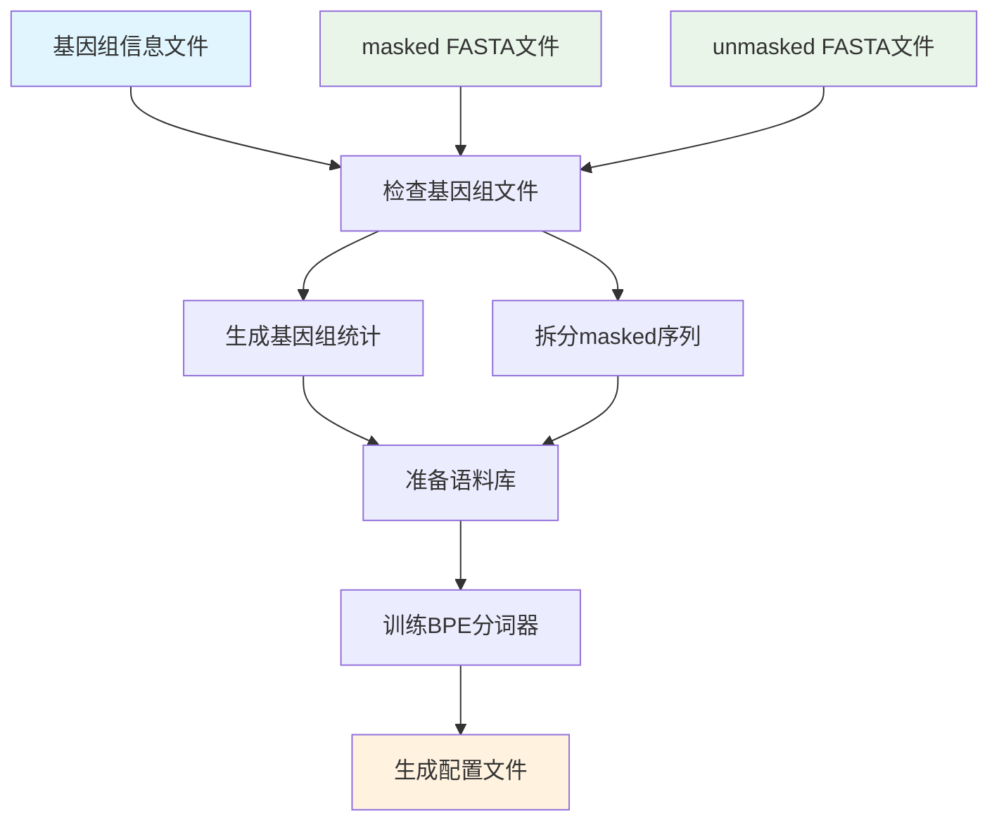

# Corpus2DNALLM

将基因组数据转换为DNA语言模型训练数据的完整工具链

[](https://python.org)
[](LICENSE)
[](https://en.wikipedia.org/wiki/Bioinformatics)

## 📖 简介

Corpus2DNALLM 是一个专业的生物信息学工具，用于将基因组序列数据转换为适合DNA语言模型训练的语料库。该工具集成了完整的处理流程，从原始基因组FASTA文件到最终的分词器配置文件。

### 主要功能

- 🔍 **基因组文件检查和大小统计** - 自动检查基因组文件完整性并生成详细统计信息
- 📚 **语料库准备** - 智能拆分基因组序列，生成训练语料库
- 🔧 **BPE分词器训练** - 使用SentencePiece训练高性能BPE分词器
- ⚙️ **配置文件生成** - 生成HuggingFace Transformers兼容的配置文件

## 🚀 快速开始

### 安装

```bash
# 克隆仓库
git clone https://github.com/yourusername/Corpus2DNALLM.git
cd Corpus2DNALLM

# 创建虚拟环境
python -m venv .venv
source .venv/bin/activate  # Linux/Mac
# 或 .venv\Scripts\activate  # Windows

# 安装依赖
pip install -e .
```

### 基本使用

#### 1. 执行完整流程

```bash
corpus2dnallm all \
    --genomes-info-path data/genomes_info.tsv \
    --masked-dir data/masked/ \
    --unmasked-dir data/unmasked/ \
    --output-dir output/
```

#### 2. 分步骤执行

```bash
# 步骤1: 准备基因组
corpus2dnallm prepare-genome \
    --genomes-info-path data/genomes_info.tsv \
    --masked-dir data/masked/ \
    --unmasked-dir data/unmasked/ \
    --output-dir output/

# 步骤2: 准备语料库
corpus2dnallm prepare-corpus \
    --genomes-info-path data/genomes_info.tsv \
    --unmasked-dir data/unmasked/ \
    --split-mask-dir output/hardmask_split/ \
    --genome-size-file output/genome_sizes.txt \
    --output-file output/corpus.txt

# 步骤3: 训练分词器
corpus2dnallm train-tokenizer \
    --input-file output/corpus.txt \
    --model-prefix output/dna_tokenizer \
    --vocab-size 8192

# 步骤4: 生成配置文件
corpus2dnallm generate-config \
    --model-path output/dna_tokenizer.model \
    --example-config-file examples/tokenizer_config.json \
    --example-tokenizer-file examples/tokenizer.json \
    --output-dir output/
```

## 📋 命令参考

### 主命令

```bash
corpus2dnallm [子命令] [选项]
```

### 子命令

#### `prepare-genome` - 基因组准备

检查基因组文件并生成大小统计信息。

**参数:**
- `--genomes-info-path`: 包含基因组信息的TSV文件路径
- `--masked-dir`: hardmasked基因组文件目录
- `--unmasked-dir`: unmasked基因组文件目录
- `--output-dir`: 输出目录

**输出文件:**
- `genome_sizes.txt` - 基因组统计信息
- `hardmask_split/` - 按N区域拆分的masked序列

#### `prepare-corpus` - 语料库准备

从基因组文件生成训练语料库。

**参数:**
- `--genomes-info-path`: 基因组信息文件路径
- `--unmasked-dir`: unmasked基因组文件目录
- `--split-mask-dir`: 分割的masked文件目录
- `--genome-size-file`: 基因组大小文件路径
- `--output-file`: 输出语料库文件路径
- `--max-seq-length`: 最大序列长度 (默认: 4000)
- `--genome-split-size`: 基因组拆分大小阈值(MB) (默认: 500)

**处理逻辑:**
- 小于500MB的基因组: 使用全部unmasked序列
- 大于500MB的基因组: 混合使用masked和unmasked序列

#### `train-tokenizer` - 分词器训练

训练BPE分词器模型。

**参数:**
- `--input-file`: 训练数据文件路径
- `--model-prefix`: 输出模型文件前缀
- `--vocab-size`: 词汇表大小 (默认: 8192)
- `--model-type`: 模型类型 (默认: bpe)
- `--num-threads`: 训练线程数 (默认: 4)

**输出文件:**
- `{model_prefix}.model` - SentencePiece模型文件
- `{model_prefix}.vocab` - 词汇表文件

#### `generate-config` - 配置生成

生成HuggingFace兼容的配置文件。

**参数:**
- `--model-path`: BPE模型文件路径
- `--example-config-file`: 示例tokenizer配置文件路径
- `--example-tokenizer-file`: 示例tokenizer文件路径
- `--output-dir`: 输出目录 (默认: 当前目录)
- `--special-token-file`: 特殊标记JSON文件路径 (可选)

**输出文件:**
- `vocab.json` - 词汇表文件
- `merges.txt` - BPE合并规则文件
- `tokenizer_config.json` - tokenizer配置文件
- `tokenizer.json` - tokenizer定义文件

## 📁 输入文件格式

### 基因组信息文件 (`genomes_info.tsv`)

TSV格式，包含基因组名称和类型：

```tsv
genome_name    genome_type
human          both
mouse          both
yeast          unmasked
```

- `genome_name`: 基因组名称 (小写)
- `genome_type`: `both` (有masked和unmasked) 或 `unmasked` (只有unmasked)

### 基因组文件

支持多种FASTA格式：
- `.fa`, `.fasta` - 未压缩FASTA
- `.fa.gz`, `.fasta.gz` - gzip压缩FASTA

文件命名示例：
- `human.fa.gz`
- `mouse.fasta`
- `yeast.fa`

## 🔄 工作流程



## 📊 处理策略

### 序列选择策略

| 基因组大小 | 处理方式 | 说明 |
|------------|----------|------|
| < 500MB | 全部unmasked序列 | 适用于小基因组 |
| ≥ 500MB | 混合策略 | 250MB masked + 250MB unmasked |

### 序列拆分规则

- **最大长度**: 4000个碱基 (可配置)
- **最小长度**: 100个碱基 (过滤过短序列)
- **特殊字符**: 转换为大写字母
- **masked区域**: 按N字符序列分割

## ⚙️ 配置选项

### 环境变量

```bash
# 设置日志级别
export CORPUS2DNALLM_LOG_LEVEL=INFO

# 设置临时目录
export CORPUS2DNALLM_TEMP_DIR=/tmp/corpus2dnallm

# 设置线程数
export CORPUS2DNALLM_NUM_THREADS=8
```

### 高级参数

```bash
# 自定义BPE参数
corpus2dnallm train-tokenizer \
    --vocab-size 16384 \
    --model-type unigram \
    --character-coverage 0.9999 \
    --num-sub-iterations 2
```

## 🔧 开发

### 本地开发

```bash
# 克隆仓库
git clone https://github.com/yourusername/Corpus2DNALLM.git
cd Corpus2DNALLM

# 安装开发依赖
pip install -e ".[dev]"

# 运行测试
pytest

# 代码格式化
black src/
flake8 src/
```

### 项目结构

```
Corpus2DNALLM/
├── src/
│   └── corpus2dnallm/
│       ├── __init__.py
│       ├── cli.py              # CLI入口点
│       ├── genome_size.py      # 基因组大小统计
│       ├── corpus_prep.py      # 语料库准备
│       ├── tokenizer_train.py  # 分词器训练
│       └── config_gen.py       # 配置生成
├── data/                       # 示例数据
├── examples/                   # 示例配置文件
├── tests/                      # 测试文件
├── pyproject.toml             # 项目配置
└── README.md                  # 本文档
```

## 📈 性能优化

### 内存优化

- 使用流式处理，避免将整个基因组加载到内存
- 自动调整缓冲区大小
- 支持gzip压缩文件直接处理

### 速度优化

- 多线程并行处理
- 智能缓存机制
- 批量IO操作

### 推荐配置

```bash
# 大基因组处理建议
export CORPUS2DNALLM_NUM_THREADS=16
export CORPUS2DNALLM_BUFFER_SIZE=1048576  # 1MB
```

## 🐛 故障排除

### 常见问题

**Q: 提示"基因组文件不存在"**

A: 检查以下几点：
- 文件路径是否正确
- 文件命名是否符合规范
- 是否有相应的文件权限

**Q: 内存不足错误**

A: 尝试以下解决方案：
- 减少线程数: `--num-threads 2`
- 减小序列长度: `--max-seq-length 2000`
- 使用更小的基因组拆分大小

**Q: 分词器训练失败**

A: 检查：
- 语料库文件是否为空
- 词汇表大小是否合理
- 输入文件编码是否为UTF-8

### 日志调试

```bash
# 启用详细日志
corpus2dnallm --verbose all [参数]

# 或设置环境变量
export CORPUS2DNALLM_LOG_LEVEL=DEBUG
```

## 📚 参考文献

1. **SentencePiece**: [Unsupervised Text Segmentation for Neural Language Models](https://arxiv.org/abs/1804.10959)
2. **BPE**: [Neural Machine Translation of Rare Words with Subword Units](https://arxiv.org/abs/1508.07909)
3. **HuggingFace Tokenizers**: [🤗 Tokenizers](https://huggingface.co/docs/tokenizers/)

## 📄 许可证

本项目采用 MIT 许可证 - 详见 [LICENSE](LICENSE) 文件

## 🤝 贡献

欢迎贡献代码！请查看 [CONTRIBUTING.md](CONTRIBUTING.md) 了解详细信息。

## 📞 联系方式

- 项目主页: https://github.com/yourusername/Corpus2DNALLM
- 问题反馈: https://github.com/yourusername/Corpus2DNALLM/issues
- 邮箱: your.email@example.com

## 🙏 致谢

感谢所有为生物信息学和自然语言处理领域做出贡献的研究者们。

---

⭐ 如果这个项目对您有帮助，请给我们一个星标！